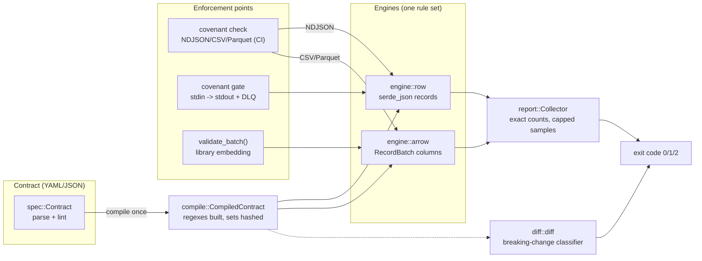
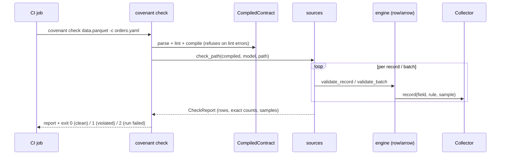

# Covenant — architecture

## System overview

Redrawn from the Mermaid source below. The drawing merges the contract container with
the `spec::Contract` parse step inside it, and merges the three enforcement points into one
node — they are three places to run the same rule set, not three components. Source:
[`docs/images/architecture-system-context.html`](docs/images/architecture-system-context.html).
The same topology as Mermaid, for diffing and for editing the drawing from:

## Check call flow

## Design thesis

The niche's complaint is that data-contract tools **describe** and never
**enforce**. So the crate is built engine-first, and storage-never:

1. **One compiled artifact.** `spec::Contract` (the YAML) is parsed and
   linted once, then compiled into `compile::CompiledContract` — regexes
   built, allowed-sets hashed into `HashSet`s, per-field checks resolved.
   Every enforcement point consumes only the compiled form; nothing on the
   hot path parses YAML, compiles a regex, or walks serde structures twice.

2. **Two engines, one rule set.** Data arrives in two shapes, so there are
   exactly two engines, both driven by the same `CompiledField` rules:
   - `engine::row` — record-at-a-time over `serde_json::Value` (NDJSON
     checks, the stream gate). Violation strings are built only when a rule
     fails; the only clean-path allocation is the canonical key for `unique`
     fields (models without `unique` allocate nothing on clean records).
   - `engine::arrow` — columnar over `RecordBatch` (CSV/Parquet checks, the
     embedding API). One pass per column, with a fast path that skips columns
     that have no per-value work (no constraints, no nulls to police).
   CSV and Parquet both funnel through the Arrow engine (arrow-csv reads CSV
   into batches) so no rule is implemented twice per format.

3. **Enforcement points are thin loops.** `sources::check_path` (CI),
   `gate::run` (streams), and `engine::arrow::validate_batch` (library) are
   each under ~100 lines of orchestration around the engines. Adding a new
   boundary (native Kafka consumer, warehouse hook) adds a loop, not rules.

## Refuse-to-half-enforce, everywhere

A gate that silently skips what it doesn't understand is worse than no gate —
it *certifies* bad data. Two mechanisms enforce honesty:

- **Compile refuses invalid contracts.** `CompiledContract::compile` runs the
  linter and errors out on any error-level finding (bad regex, min > max,
  empty allowed-set, constraint on the wrong type). There is no mode where a
  half-understood contract enforces "what it can".
- **Unsupported columns are violations, not skips.** The Arrow engine's type
  compatibility check and its per-type iteration arms are written to admit
  exactly the same set (the `unreachable!` in `check_column` keeps them from
  drifting). Dictionary-encoded, decimal, and Float16 columns are reported as
  `schema_type_mismatch` with an explanatory message rather than half-checked.

## Columnar null semantics (the one real impedance mismatch)

JSON records distinguish *absent key* from *explicit null*; columns cannot —
a missing value and a null are the same validity bit. The mapping:

| Contract field | JSON record | Arrow column |
|---|---|---|
| `required` + column/key missing | `required_missing` per row | `schema_missing_field` (batch-level) |
| optional + missing | passes | column absent → passes |
| `required`, not `nullable`, value null | `null_not_allowed` | `null_not_allowed` per row |
| optional, not `nullable`, value null | `null_not_allowed` (an explicit null was *sent*) | **passes** — indistinguishable from absent |
| `nullable`, value null | passes | passes |

The one asymmetry (optional non-nullable nulls) is inherent to the columnar
representation and documented rather than papered over.

## Violation accounting

`report::Collector` keeps **exact counts** per (field, rule) and **capped
samples** (`policy.sample_violations`, default 10). The columnar engine uses
`Collector::record(field, rule, make_fn)` so the sample `Violation` — with
its formatted message — is only constructed while the cap has room; a
million-row disaster costs a counter bump per violation, not a string. Exit
codes compare the exact total against `policy.max_violations`.

Uniqueness is exact and in-memory (`engine::UniqueTracker`, a per-field
`HashSet` of canonical value renderings), shared across batches so
duplicates spanning row groups are caught. In `gate` mode the set grows with
stream cardinality — `--no-unique` turns it off for unbounded streams (a
bounded/keyed-window strategy is on the roadmap).

## The diff engine

`diff::diff` classifies each change on two axes — severity (`breaking >
risky > info`) and impact (`producers` / `consumers` / `both`):

- Removing a field or model, changing a type, making a field nullable:
  **breaking** (consumers); adding a required field, un-nullable-ing:
  breaking/risky toward **producers**.
- Constraint *tightening* (min raised, max lowered, allowed narrowed,
  pattern added) hits **producers** — conforming data starts failing.
  Constraint *loosening* hits **consumers** — a guarantee they may rely on
  is gone. Pattern *changes* are conservatively "both" (regex inclusion is
  undecidable; no cleverness pretended).
- `integer → float` is recognized as representational widening (**risky**,
  consumers) rather than flatly breaking.

The classifier then enforces semver: breaking ⇒ major bump, risky ⇒ minor,
info ⇒ any bump; an insufficient bump is itself emitted as a **breaking**
finding on `version`. `--fail-on breaking|risky|any|never` maps severity to
exit code 1 for CI.

## The stream gate

`gate::run` is deliberately transport-agnostic: NDJSON on stdin, clean
records verbatim on stdout, rejected records as one-line JSON **DLQ
envelopes** (contract id/version, model, row, the record itself, and its
violation list — enough to replay after the producer is fixed). Policy
`block` withholds dirty records from stdout; the exit code is 1 only when
total violations exceed `policy.max_violations` — with a positive budget the
gate can block records and still exit 0 (the budget is the tolerated dirt,
the DLQ still captures it). `warn` passes everything through and reports.
Records larger than ~16 MiB are dead-lettered unparsed (truncated preview)
rather than buffered without bound — the gate must not be the component that
gets OOM-killed. The DLQ file is opened in append mode: a rerun never
destroys the previous run's dead letters. Piped between `kcat -C` and `kcat -P` it is a Kafka SMT; reading a
dump in a CronJob it is a warehouse pre-load hook. A native Kafka
consumer/producer mode (librdkafka behind an off-by-default feature) is
roadmap, not prerequisite — the workspace build stays free of C toolchains.

## Dependency posture

Lean dependency rules: the arrow/parquet **58** line is shared with the rest
of the toolchain rather than pinned separately, so the columnar
engine costs the monorepo nothing new; everything else is small pure-Rust
(serde/regex/semver/chrono/indexmap). No async runtime — every enforcement
point is a synchronous loop, which is exactly what CI steps and pipe
interceptors want.

## Known limits (v0.1)

- Dictionary/decimal/Float16 Arrow columns → honest `schema_type_mismatch`
  (roadmap: decode dictionaries, a `decimal` contract type).
- No nested fields (JSON objects/arrays validate only as "unexpected type";
  dotted-path addressing is roadmap).
- `unique` in gate mode is memory-unbounded (exact); `--no-unique` opts out.
- No freshness/SLA checks — they need a clock and state, which belongs to
  a stateful control layer, not the inline runtime.
