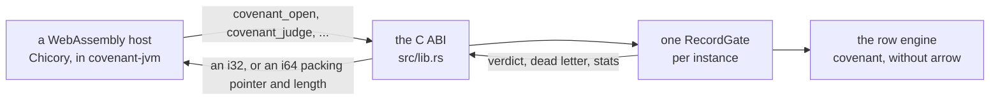
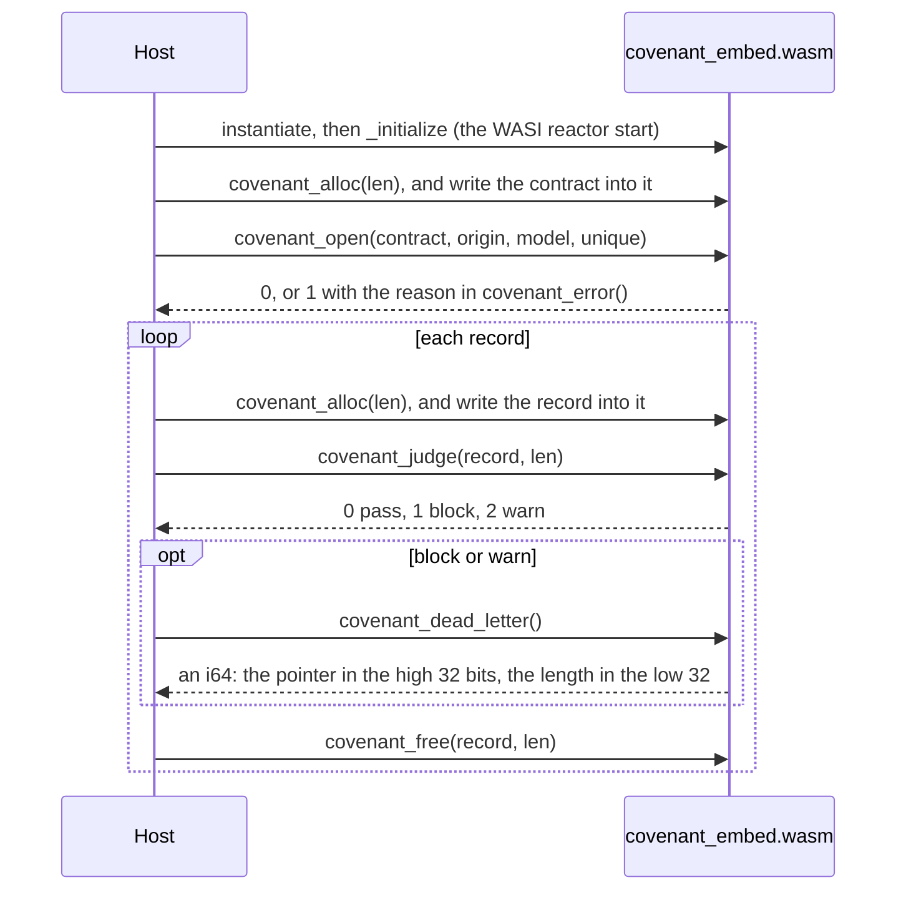

# covenant-embed: the gate for WebAssembly hosts

The Covenant gate as a WebAssembly reactor module (`wasm32-wasip1`) with a small C ABI. A
WebAssembly runtime can load it and judge records with no native code: `covenant-jvm` runs it
on the JVM through [Chicory](https://github.com/dylibso/chicory), and any host that can
instantiate a WASI reactor and call its exports can do the same. The module links the engine
without its Arrow half (`default-features = false`), so it carries only the row engine that
`covenant gate` judges records with, and gives the same verdicts and dead letters.

## Quickstart

```bash
rustup target add wasm32-wasip1
cargo build --release --target wasm32-wasip1
ls target/wasm32-wasip1/release/covenant_embed.wasm
```

In `integrations/jvm`, `mvn verify` runs this build and bundles the module into `covenant-jvm`,
so JVM users never build it by hand.

## How it fits



One instance holds one gate. Everything the gate keeps (unique keys, row numbers, counts)
lives in the instance's memory; to gate another contract, a host instantiates the module again.

## One record through the ABI



## The ABI

Bytes cross through the instance's memory. The host asks for a buffer with `covenant_alloc`,
writes into it, passes pointer and length, and gives it back with `covenant_free`. A result the
module returns is packed into an `i64` and stays valid until the next call into the module.
`src/lib.rs` is the reference.

| Export | Returns |
|---|---|
| `covenant_alloc(len) -> ptr` | a buffer of `len` bytes |
| `covenant_free(ptr, len)` | |
| `covenant_open(contract, contract_len, origin, origin_len, model, model_len, unique) -> i32` | 0, or 1 with the reason in `covenant_error` |
| `covenant_judge(record, record_len) -> i32` | 0 pass, 1 block, 2 warn; -1 when no gate is open |
| `covenant_dead_letter() -> i64` | the dead letter of the record just judged (JSON), empty after a pass |
| `covenant_stats() -> i64` | `{"records", "passed", "blocked", "warned", "failed"}` (JSON) |
| `covenant_error() -> i64` | why the last `covenant_open` failed (UTF-8) |

`unique` says what to do with a model's `unique` fields: 0 refuses a model that declares any
(the open fails and names them), 1 skips them, 2 tracks them, exactly, across what this
instance judges.
