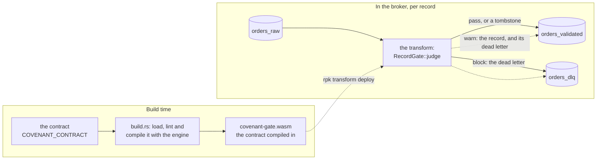
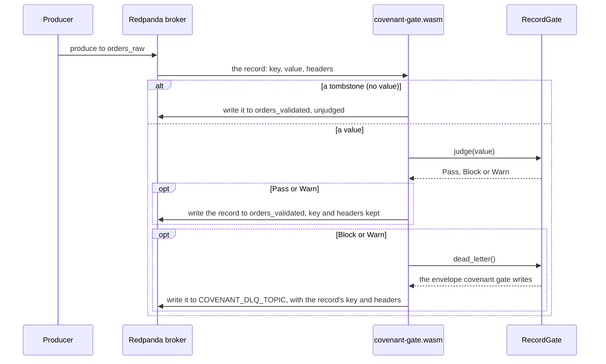

# Covenant as a Redpanda Data Transform

The gate running inside the broker. Redpanda runs this module, compiled to WebAssembly, on
every record written to a topic. Each record is judged by the same `RecordGate` as
`covenant gate`:

- a record that keeps the contract goes to the first output topic, unchanged, with its key
  and headers;
- a record that breaks it becomes a dead letter on the DLQ topic, with the record's key and
  headers and the envelope `covenant gate` writes as its value;
- a tombstone (a record with no value) goes on unjudged.

Under `on_violation: warn` the record goes on and its dead letter is written as well.



## Quickstart

From this directory, with `rpk` pointed at a Redpanda cluster:

```bash
rustup target add wasm32-wasip1
COVENANT_CONTRACT=../../examples/contracts/orders.yaml COVENANT_NO_UNIQUE=1 rpk transform build

rpk cluster config set data_transforms_enabled true       # once; the brokers need a restart
rpk topic create orders_raw orders_validated orders_dlq
rpk transform deploy                                       # the topics in transform.yaml

echo '{"order_id":"ord_a1b2c3d4e5f6","amount_cents":12999,"currency":"USD","created_at":"2026-08-11T09:30:00Z"}' | rpk topic produce orders_raw
echo '{"order_id":"ord_a1b2c3d4e5f7","amount_cents":-5,"currency":"USD","created_at":"2026-08-11T09:30:00Z"}' | rpk topic produce orders_raw
rpk topic consume orders_validated -n 1    # the first order, unchanged
rpk topic consume orders_dlq -n 1          # the second, as a dead letter: amount_cents below min 0
```

The sections below explain each step.

## Build

The contract is compiled into the module. The build loads, lints and compiles it with the
engine, so a contract the transform could not enforce exactly fails the build, not the
broker:

```bash
rustup target add wasm32-wasip1

COVENANT_CONTRACT=path/to/orders.yaml rpk transform build    # or: cargo build --release
```

| Variable | |
|---|---|
| `COVENANT_CONTRACT` | The contract, `covenant: 1` or ODCS v3; absolute, or relative to this directory. Required. |
| `COVENANT_MODEL` | The model to enforce, when the contract has more than one. |
| `COVENANT_NO_UNIQUE=1` | Build even though the model declares `unique` fields, without enforcing them. |

A transform keeps its state per partition and loses it on restart, so it cannot hold `unique`
across a topic. The build refuses a model with `unique` fields until you set
`COVENANT_NO_UNIQUE=1`, the counterpart of `covenant gate --no-unique`. To keep `unique`,
run `covenant gate` itself, where it spans everything one process reads.

## Deploy

The build writes `covenant-gate.wasm`. `transform.yaml` names the topics. The first output
topic receives the records that go on. `COVENANT_DLQ_TOPIC` names the output topic dead
letters go to, and without it the transform does not start, so a dead letter is never
dropped:

```bash
rpk cluster config set data_transforms_enabled true       # once; the brokers need a restart
rpk topic create orders_raw orders_validated orders_dlq
rpk transform deploy                                       # the topics in transform.yaml

# or name everything at deploy time:
rpk transform deploy --file covenant-gate.wasm --name covenant-orders \
  --input-topic orders_raw --output-topic orders_validated --output-topic orders_dlq \
  --var COVENANT_DLQ_TOPIC=orders_dlq
```

Dead letters need a second output topic, so the broker must support transforms with several
output topics; it is tested on Redpanda 26.2.3. The module fits Redpanda's default 2 MiB of
memory per transform instance: a 256 KiB stack (set by `build.rs`) and about 400 KiB of static
data leave well over a megabyte for the heap.

## How a record is judged



The gate's state (row numbers, counts) lives in the transform instance, one per partition,
and starts again when the broker restarts the transform.

## Tested

```bash
# the judgement, on the host (the default target here is wasm32-wasip1)
COVENANT_CONTRACT=../../examples/contracts/orders.yaml COVENANT_NO_UNIQUE=1 \
  cargo test --target "$(rustc -vV | sed -n 's/^host: //p')"

# the module deployed into a real Redpanda, held to `covenant gate`
python3 e2e.py <covenant binary> <covenant-gate.wasm> ../../examples/contracts/orders.yaml
```

`e2e.py` deploys the module and sends it the demo orders, each with a key and a header, plus a
tombstone. It then checks three things against `covenant gate --no-unique` on the same records:
the passed records match byte for byte with their keys and headers, the dead letters are
identical apart from their timestamps, and the tombstone arrives as a tombstone. CI runs it
against Redpanda 26.2.3.
