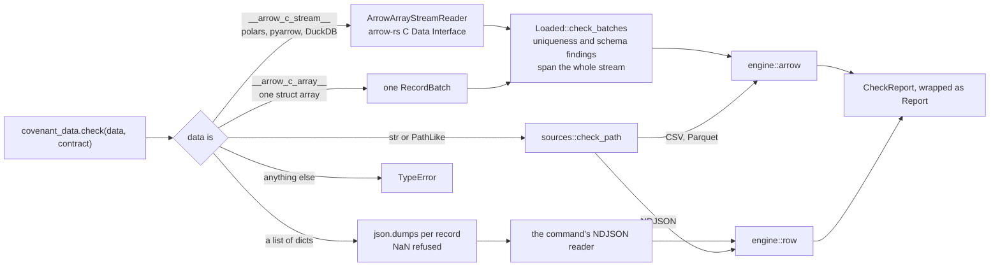
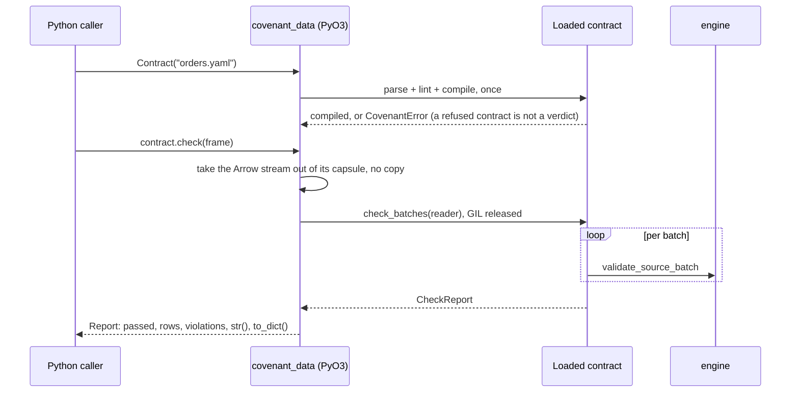

# covenant_data — architecture

The Python face adds no engine of its own. A `Contract` is compiled by the code
the `covenant` command uses, the data goes to the engine the command would pick
for it, and a `Report` wraps the command's own report. A verdict here is the
verdict the command gives, and `tests/test_covenant_data.py` holds the two equal.

## Where the data goes

## A check call

## Decisions

- **The command's readers, not new ones.** Records become NDJSON lines and go
  through the reader `covenant check` uses for an NDJSON file, and a path goes
  through the command's own `check_path`, so the module and the command share
  every step after the bytes.
- **arrow-rs's C Data Interface.** The PyCapsule protocol is imported with
  arrow-rs's own `ffi` module; `pyo3-arrow` would do the same import but pin a
  different pyo3 and add NumPy to the build.
- **The GIL is released** while the engine runs, so other Python threads keep
  going during a long check.
- **An error is never a verdict.** `CovenantError` means the contract or the
  data could not be read; a failing check returns a `Report` whose `passed` is
  false, as the command exits 1 rather than 2.
- **One wheel.** abi3 from CPython 3.9, with the `covenant` command as a console
  script that runs the same code in-process.
